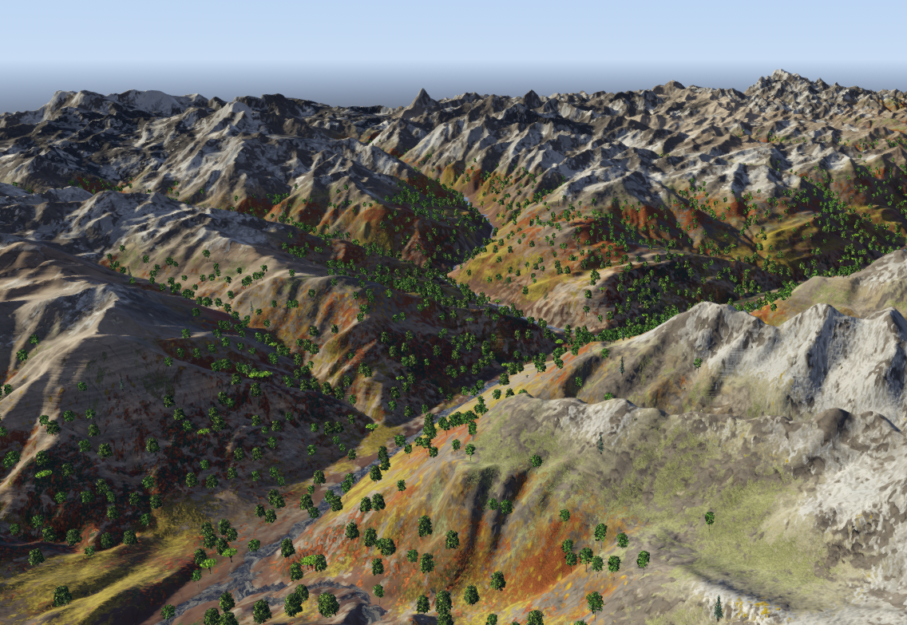
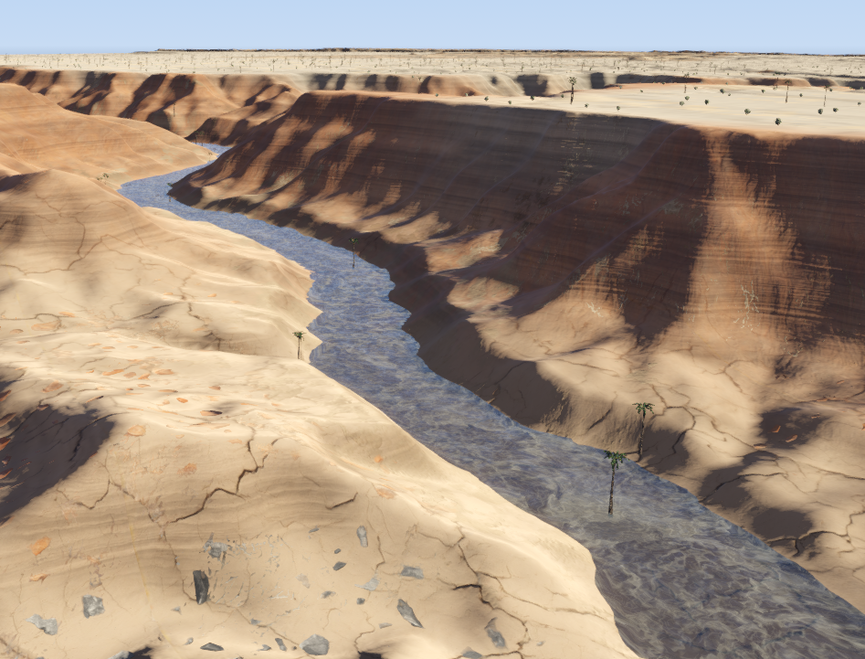

# Faber Terrae

**The entire Earth, rendered.**

One config file. Any region on the planet. Fully automated 3D terrain from real-world scientific data. No hand-painting. No manual texturing. Pure geography.

---

---

## Any Place on Earth

Alpine glacial valleys. Saharan sand seas. Tropical rainforest. Arctic tundra. Mediterranean coast. Volcanic highlands. Canyon systems carved by ancient rivers.

Define a bounding box. Get a rendered 3D world.

<table>
  <tr>
    <td align="center"> <strong>Swiss Alps</strong></td>
    <td align="center"> <strong>Andalusia</strong></td>
  </tr>
  <tr>
    <td align="center"> <strong>Sinai</strong></td>
    <td align="center"> <strong>Grand Canyon</strong></td>
  </tr>
</table>

---

## Six Layers Per Pixel

Elevation. Landform. Land cover. Climate. Geology. Surface composition. All derived from 10 satellite and scientific datasets at up to 10m resolution. Combined per-pixel — every surface looks the way it does because the real place looks that way.

<table>
  <tr>
    <td align="center"> <strong>Elevation</strong></td>
    <td align="center"> <strong>Landform</strong></td>
    <td align="center"> <strong>Land Cover</strong></td>
  </tr>
  <tr>
    <td align="center"> <strong>Climate</strong></td>
    <td align="center"> <strong>Lithology</strong></td>
    <td align="center"> <strong>Lakes</strong></td>
  </tr>
</table>

---

## 100+ Terrain Textures

Ground, rock, sand, snow, moss, marsh, riverbeds, cliff strata — driven by geology, climate, and weathering. Multi-layer height blending with no repeating visual patterns.

Mountains show the correct rock type. Soils shift with volcanic, calcareous, or sedimentary substrate. Beaches go from coral white in the tropics to dark gravel in the Arctic. Cliff faces reveal real sedimentary strata. Riverbeds carry climate-appropriate sediment.

No two regions look the same, because no two regions are the same.

---

## 50+ Vegetation Species

Ecologically accurate. Placed by ecosystem, not by hand.

Temperate forests: oaks, beeches, ashes, hollies. Mediterranean: cork oaks, olives, umbrella pines, maquis. Tropical: palms, bamboo, baobabs, giant broadleaf canopy. Boreal taiga: spruce, pine, larch, birch. Steppe: sagebrush, saltbush. Tundra: dwarf willows, crowberry on permafrost.

Every species at the right scale, the right density, in the right biome.

---

## Rivers and Lakes

Real river networks from global hydrological data. Real topology, real discharge, real depth. Carved valleys with water surface geometry.

Real lake shorelines with bathymetry.

---

## 10 Scientific Data Sources

| Source | Resolution | Provides |
|--------|-----------|----------|
| Copernicus GLO-30 | 30 m | Elevation |
| ESA WorldCover | 10 m | Land cover |
| GLC_FCS30 | 30 m | Land cover refinement |
| GBLU | 30 m | Landform classification |
| HydroLAKES | Vector | Lake geometry |
| HydroRIVERS | Vector | River networks + discharge |
| Köppen-Geiger | ~1 km | Climate zones |
| GLiM | Vector | Rock types |
| SoilGrids | 250 m | Surface composition |
| GSHHG | Full-res | Coastlines |

All downloaded automatically for any region.

---

## GPU-Accelerated

Full region builds in minutes. Multi-resolution output scaling to tens of millions of pixels.

Dynamic lighting. **Godot 4** and **Unreal Engine 5**.