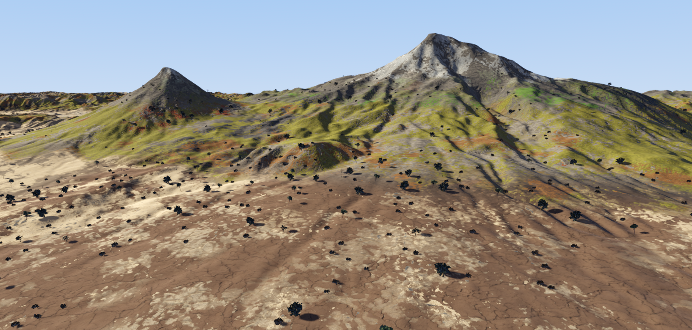
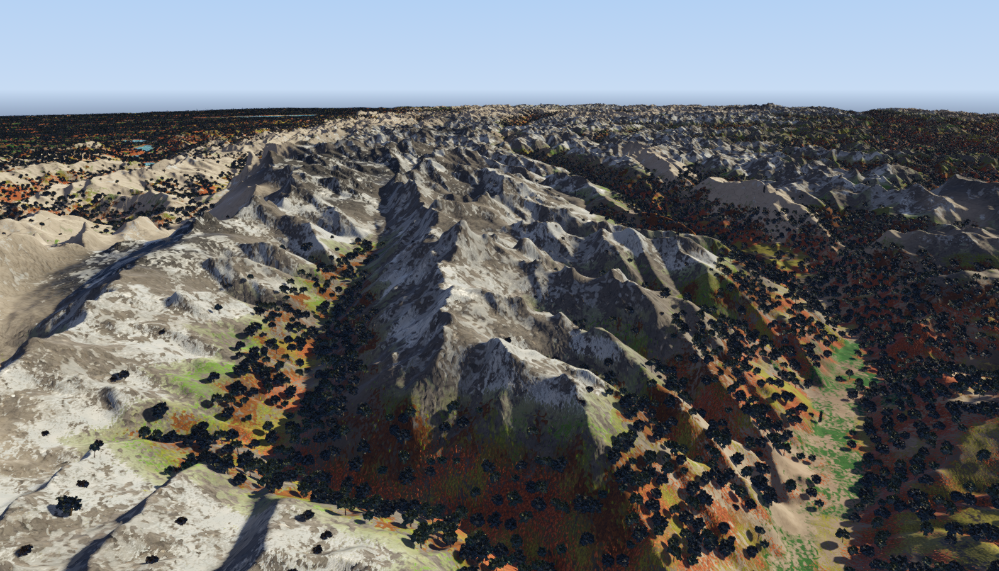
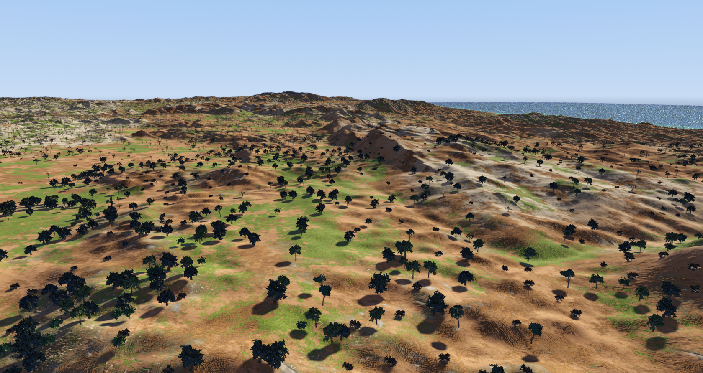
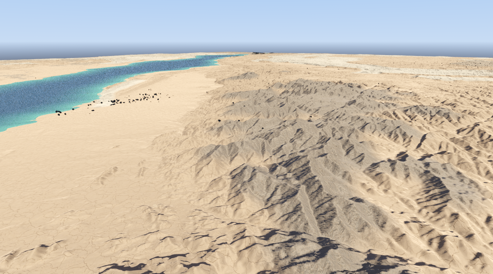
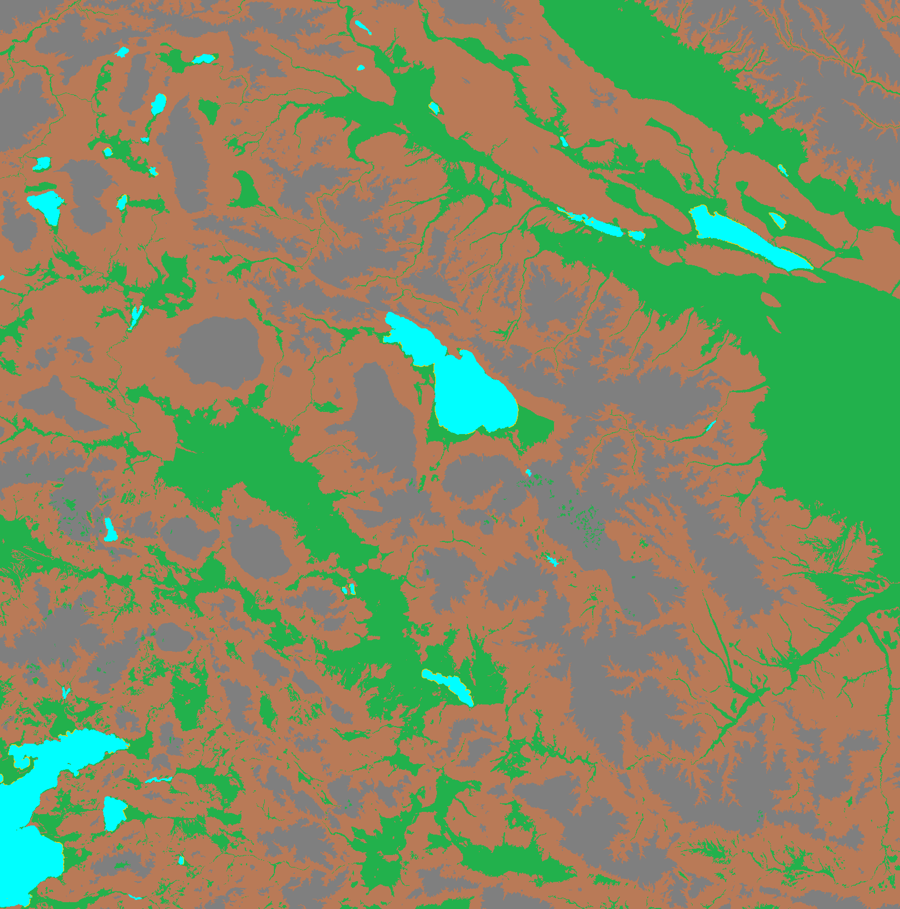
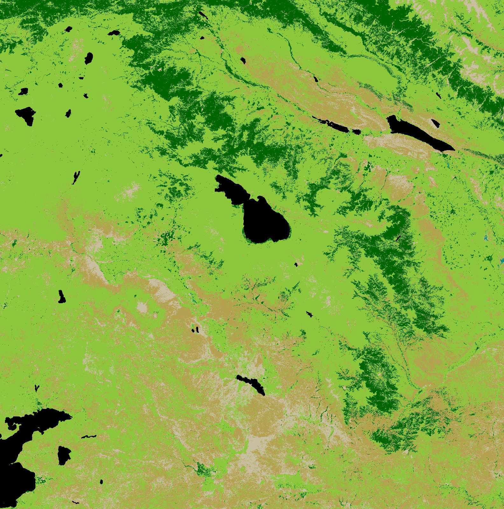
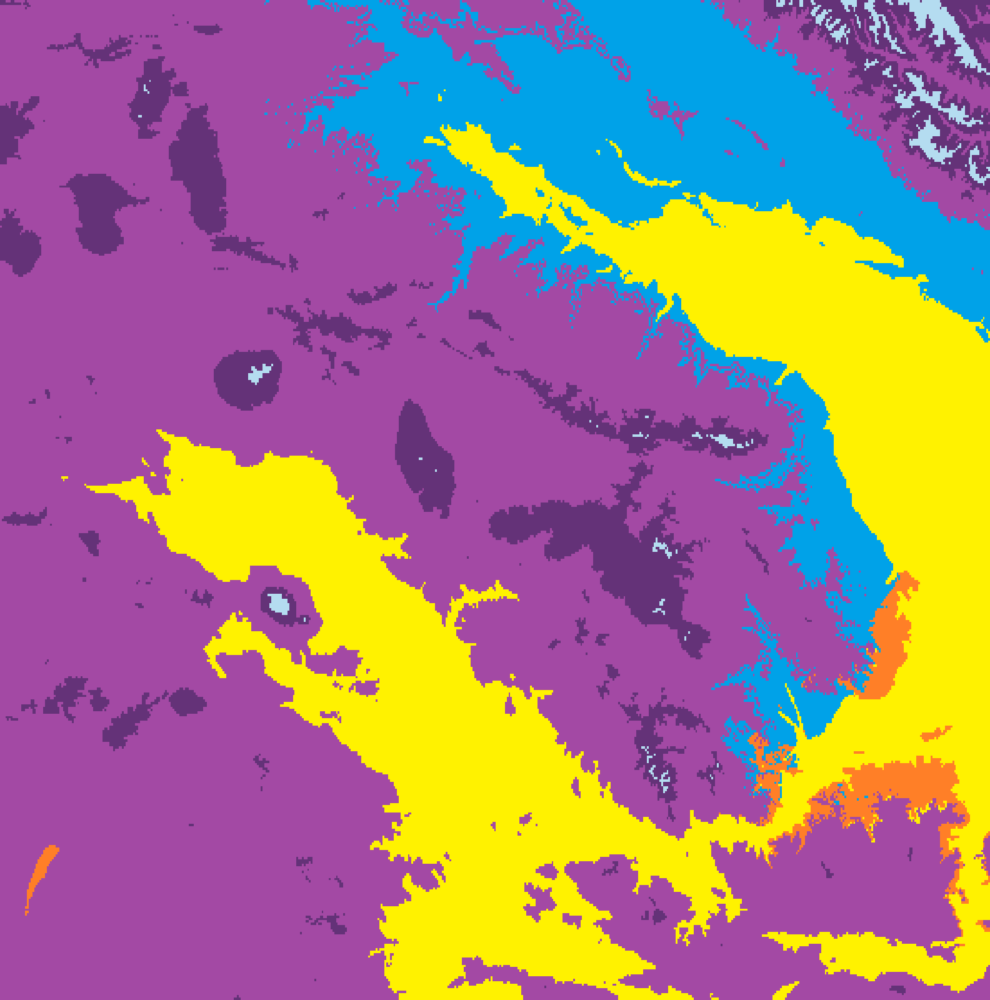
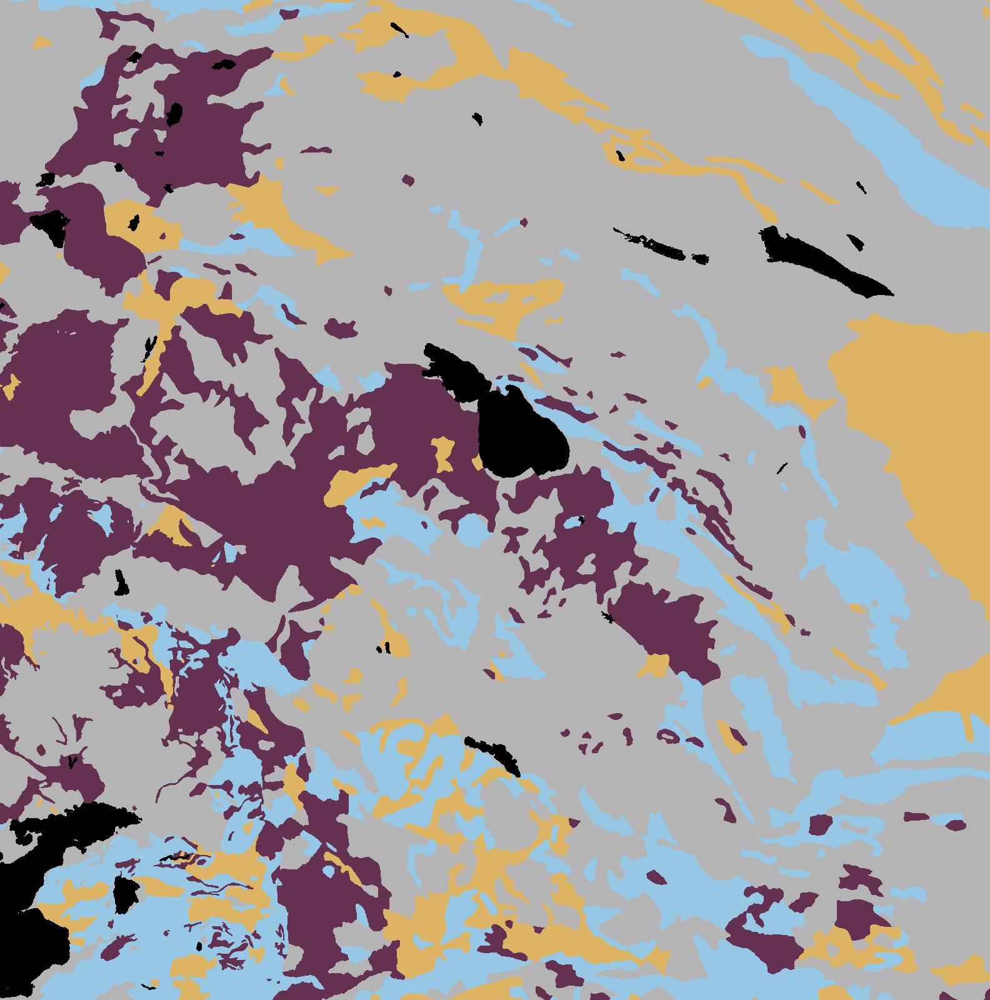
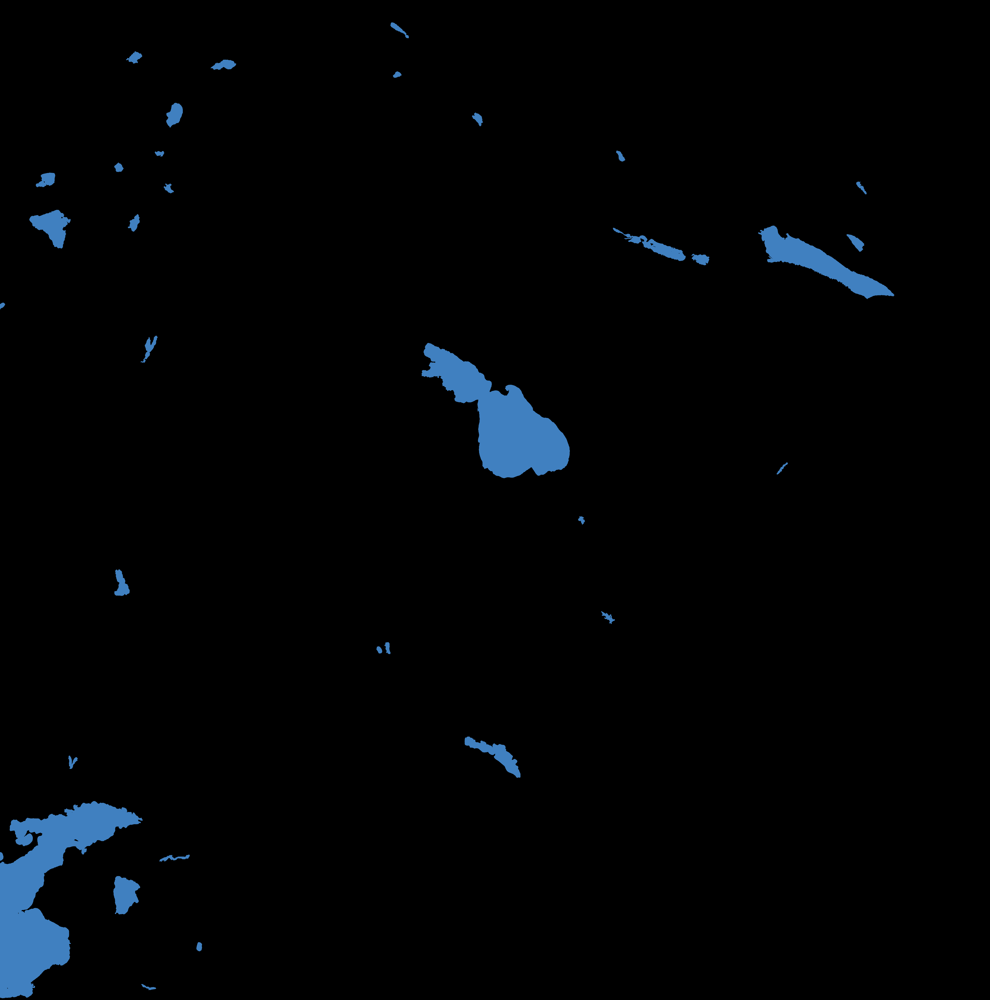

# Faber Terrae

**3D terrain generation from real-world geographic data.**

Point it at any region on Earth. It builds accurate, layered 3D terrain — elevation, vegetation, rivers, lakes, climate, geology — ready for rendering.

Built for simulation, geographic visualization, and game development. Define a region, get terrain. Everything between raw geographic data and final output is automated.

---

---

## How It Works

One config, fully automated pipeline, rendered terrain. It downloads satellite imagery, hydrological networks, climate classifications, and geological surveys, then fuses them into a unified multi-layer terrain.

## Capabilities

- **Any region on Earth** — define a geographic bounding box, everything else is automatic
- **10 scientific data sources** — satellite elevation, land cover, river networks, lakes, climate zones, geological composition, coastlines — downloaded and fused automatically
- **5 terrain classification layers** — landform, vegetation, climate, lithology, surface type — combined per-pixel for natural variety without hand-painting
- **River and lake modeling** — real-world river topology with discharge data, lake bathymetry from shoreline geometry
- **Multi-resolution** — classification, terrain detail, and elevation at independent resolutions, scaling to tens of millions of pixels
- **GPU-accelerated** — full region builds in minutes

---

<table>
  <tr>
    <td align="center"><strong>Swiss Alps</strong> </td>
    <td align="center"><strong>Southern Andalusia</strong> </td>
  </tr>
  <tr>
    <td align="center" colspan="2"><strong>Sinai Peninsula</strong> </td>
  </tr>
</table>

*All generated from geographic data. No hand-painting, no manual texturing.*

---

## Terrain Layers

<table>
  <tr>
    <td align="center"><strong>Elevation</strong> </td>
    <td align="center"><strong>Landform</strong> </td>
    <td align="center"><strong>Land Cover</strong> </td>
  </tr>
  <tr>
    <td align="center"><strong>Climate</strong> </td>
    <td align="center"><strong>Lithology</strong> </td>
    <td align="center"><strong>Lakes</strong> </td>
  </tr>
</table>

---

## Data Sources

| Dataset | Type | Resolution | Provides |
|---------|------|-----------|----------|
| SRTM | Satellite | 30m | Elevation |
| ESA WorldCover | Satellite | 10m | Land cover |
| GLC_FCS30 | Satellite | 30m | Land cover refinement |
| GBLU | Satellite | 30m | Landform classification |
| HydroLAKES | Hydrological | Vector | Lake bodies |
| HydroRIVERS | Hydrological | Vector | River networks + discharge |
| Köppen-Geiger | Climate | ~1km | Climate zones |
| GLiM | Geological | Vector | Rock types |
| SoilGrids | Geological | 250m | Surface composition |
| GSHHG | Geographic | Full-res | Coastlines |

